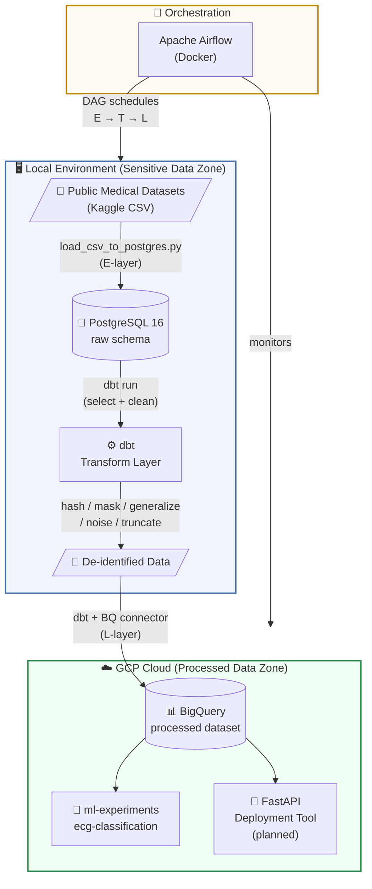

# medical-pipeline

A production-style batch data pipeline built on publicly available, de-identified medical datasets.  
Designed to mirror real-world healthcare data compliance practices — raw data stays local, only de-identified data reaches the cloud.

> Part of the [`data-pipeline-lab`](https://github.com/yourname/data-pipeline-lab) portfolio.

---

## Project Goals

This project demonstrates a complete **E → T → L batch pipeline** with a local/cloud split storage architecture:

| Layer | Role | Tool |
|---|---|---|
| **Extract** | Load raw CSV into local PostgreSQL | Python + SQLAlchemy |
| **Transform** | De-identify & clean data | dbt (runs locally) |
| **Load** | Push processed data to cloud | dbt + BigQuery connector |
| **Orchestrate** | Schedule & monitor the full pipeline | Apache Airflow (Docker) |

---

## Architecture & Data Flow



---

## Privacy Handling (T-Layer)

All de-identification is performed by dbt **before** any data leaves the local environment.

| Risk Level | Columns | Technique |
|---|---|---|
| 🔴 High | Patient ID, SSN | SHA-256 Hash (one-way, preserves uniqueness) |
| 🔴 High | Postal Code | Truncation (keep first 3 digits only) |
| 🟡 Medium | Age | Generalization (convert to age brackets: 0–17, 18–34 …) |
| 🟡 Medium | Numeric vitals | Noise Addition (random ±δ within clinical tolerance) |
| 🟢 Low | Diagnosis codes | Kept as-is (already de-identified in source) |

Full field-level details: [`docs/privacy-handling.md`](docs/privacy-handling.md)

---

## Tech Stack

| Tool | Version | Role |
|---|---|---|
| PostgreSQL | 16 | Local raw storage |
| dbt-postgres | latest | Transform + privacy processing |
| Apache Airflow | 2.x (Docker) | Orchestration |
| GCP BigQuery | — | Cloud processed storage |
| MSSQL | 2022 (Docker) | Secondary practice target |
| Python | 3.11+ | Extract scripts, utilities |

---

## Repository Structure

```
medical-pipeline/
├── README.md                   ← This file (English)
├── README_zh.md                ← Chinese version
├── data/
│   └── raw/                    ← Place source CSV files here (not committed)
├── extract/
│   └── load_csv_to_postgres.py ← E-layer: bulk CSV → PostgreSQL
├── transform/
│   └── medical_pipeline/       ← dbt project root
│       ├── models/
│       │   ├── staging/        ← Light cleaning, rename columns
│       │   └── mart/           ← De-identified, analysis-ready tables
│       └── tests/              ← dbt data quality tests
├── load/                       ← L-layer: BigQuery export scripts
├── orchestration/
│   └── dags/                   ← Airflow DAG definitions
├── notebooks/                  ← EDA & exploratory analysis
├── docs/
│   ├── pipeline-design.md      ← Architecture decisions + trade-offs
│   └── privacy-handling.md     ← Field-level privacy documentation
└── demo/                       ← Screenshots / recordings
```

---

## Quick Start

### Prerequisites

- Docker Desktop (running)
- Python 3.11+ with `.venv`
- GCP project with BigQuery enabled (for L-layer)

### 1. Start infrastructure

```bash
docker compose up -d
docker compose ps        # confirm postgres, pgadmin, mssql are running
```

### 2. Activate virtual environment

```bash
# Windows (PowerShell)
.\.venv\Scripts\Activate.ps1

# macOS / Linux
source .venv/bin/activate
```

### 3. Install dependencies

```bash
pip install pandas psycopg2-binary sqlalchemy python-dotenv
```

### 4. Load raw data (E-layer)

Place your CSV files under `data/raw/`, then:

```bash
python extract/load_csv_to_postgres.py --csv_dir ./data/raw
```

Each CSV becomes a table under the `raw` schema in PostgreSQL.  
Verify in DBeaver: `medical_db → Schemas → raw → Tables`.

### 5. Run dbt transforms (T-layer)

```bash
cd transform/medical_pipeline
dbt run
dbt test
```

### 6. Load to BigQuery (L-layer)

```bash
# configure GCP credentials first
dbt run --target prod
```

---

## Progress

| Milestone | Status |
|---|---|
| Docker + PostgreSQL + pgAdmin setup | ✅ Done |
| DBeaver dual connection | ✅ Done |
| dbt initialized (`dbt run` + `dbt test` passing) | ✅ Done |
| Dataset selection + EDA | ⬜ In progress |
| E-layer: CSV → PostgreSQL | ⬜ In progress |
| T-layer: dbt models + privacy handling | ⬜ Pending |
| L-layer: PostgreSQL → BigQuery | ⬜ Pending |
| Airflow DAG | ⬜ Pending |
| Demo recording | ⬜ Pending |

---

## Design Decisions

Key trade-offs are documented in [`docs/pipeline-design.md`](docs/pipeline-design.md).

Decision template used throughout this project:

> *"I considered A, chose B, because C — but B becomes a drawback when D."*

---

## Downstream Projects

```
medical-pipeline  (this repo)
    └── ml-experiments
        └── ecg-classification   ← 1D CNN binary classification
    └── FastAPI deployment tool  ← planned AI Engineer extension
```

---

## License

This project uses publicly available, de-identified datasets.  
Source dataset license applies to the data. Code is MIT licensed.