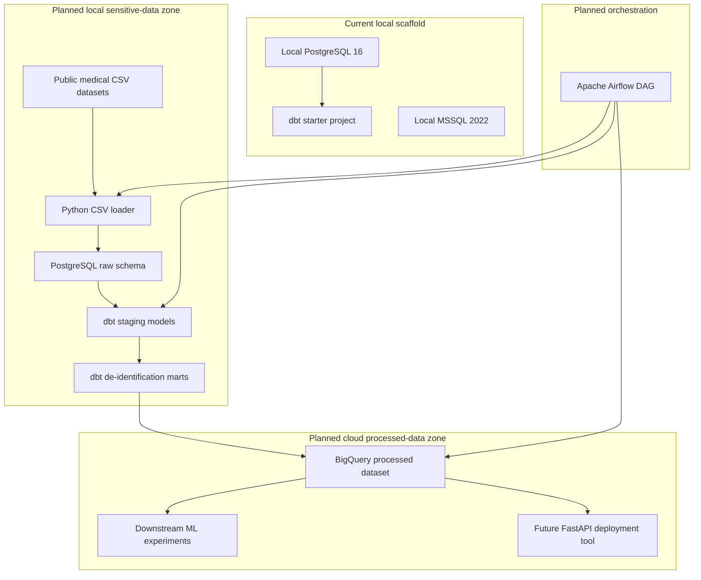

# medical-pipeline

A production-style batch data pipeline project for publicly available, de-identified medical datasets.

The target design mirrors a healthcare data workflow where raw data stays local and only de-identified, analysis-ready data can move to the cloud. The project is currently an early-stage pipeline scaffold: local database services and a dbt starter project exist, while the extract, privacy transform, BigQuery load, and Airflow orchestration layers are still planned work.

Part of the `data-pipeline-lab` portfolio.

---

## Current Status

- [X] Docker Compose local services: PostgreSQL + MSSQL
- [X] DBeaver chosen as the DB inspection tool
- [X] dbt starter project initialized under `medical_pipeline/`
- [X] README first full project outline drafted

Current active Docker Compose services:

```text
postgres
mssql
```

pgAdmin is no longer part of the current project setup because it was unreliable in local use. Database inspection is handled through DBeaver.

---

## Target Architecture

The planned pipeline is an **E -> T -> L batch pipeline** with a local/cloud split:

| Layer | Planned Role | Planned Tooling |
|---|---|---|
| Extract | Load raw CSV files into local PostgreSQL | Python + SQLAlchemy |
| Transform | Clean, model, and de-identify local data | dbt |
| Load | Publish processed data to BigQuery | dbt + BigQuery connector |
| Orchestrate | Schedule and monitor the full pipeline | Apache Airflow |



Planned privacy handling in the transform layer:

| Risk Level | Example Columns | Planned Technique |
|---|---|---|
| High | Patient identifiers | One-way hashing |
| High | Postal code | Truncation |
| Medium | Age | Age brackets |
| Medium | Numeric vitals | Controlled noise within clinical tolerance |
| Low | Diagnosis codes | Keep when already de-identified by source |

---

## Current Repository Structure

This is the current version-controlled project shape:

```text
medical-pipeline/
├── README.md
├── LICENSE
├── docker-compose.yml
├── medical_pipeline/
│   ├── dbt_project.yml
│   ├── README.md
│   └── models/
│       ├── hello_dbt.sql
│       ├── hello_dbt.yml
│       └── example/
│           ├── my_first_dbt_model.sql
│           ├── my_second_dbt_model.sql
│           └── schema.yml
```

Local data and generated files are intentionally not committed. Future directories such as `extract/`, `load/`, `docs/`, `orchestration/`, `notebooks/`, and `demo/` are part of the target architecture, but they do not yet contain version-controlled implementation files.

---

## Quick Start

### Prerequisites

- Docker Desktop running
- A local `.env` based on `.env.example`
- A dbt-capable Python environment, such as the local `.venv`
- DBeaver for database inspection

### 1. Start local services

```bash
docker compose up -d
docker compose ps
```

Confirm the active services are `postgres` and `mssql`.

### 2. Inspect databases with DBeaver

Use DBeaver to connect to:

| Service | Host | Port |
|---|---|---|
| PostgreSQL | localhost | 5432 |
| MSSQL | localhost | 1433 |

Credentials come from your local `.env` file.

### 3. Run the dbt starter smoke check

```bash
cd medical_pipeline
dbt run --select hello_dbt
dbt test --select hello_dbt
```

The current dbt project is still a starter scaffold. Real staging and mart models will replace the starter examples later.

---

## Todo / Roadmap

- [ ] (In progress) Dataset selection and local raw data review
- [ ] (In progress) EDA notes and dataset shape understanding
- [ ] (Pending) Build CSV -> PostgreSQL loader
- [ ] (Pending) Create raw schema loading flow
- [ ] (Pending) Replace dbt starter models with real staging models
- [ ] (Pending) Add mart models with de-identification logic
- [ ] (Pending) Add field-level privacy handling documentation
- [ ] (Pending) Add BigQuery target/load path
- [ ] (Pending) Add Airflow DAG
- [ ] (Pending) Add demo screenshots or recording

---

## Tech Stack

| Tool | Version / Target | Current Status |
|---|---|---|
| PostgreSQL | 16 | Done: local Docker service |
| MSSQL | 2022 | Done: local Docker service for secondary practice |
| DBeaver | Local desktop client | Done: selected DB inspection tool |
| dbt-postgres | Local Python environment | Started: dbt starter project |
| Python | 3.11+ target | Planned for extract scripts and utilities |
| GCP BigQuery | Target cloud warehouse | Planned |
| Apache Airflow | Docker target | Planned |

---

## Downstream Projects

Planned downstream uses:

```text
medical-pipeline
    -> ml-experiments / ecg-classification
    -> future FastAPI deployment tool
```

---

## License

This project uses publicly available, de-identified datasets. Source dataset licenses apply to the data. Code is MIT licensed.
